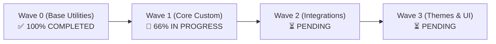

# Antigravity Workflow: Migration Status Dashboard

## Purpose
Renders a comprehensive, real-time Markdown status dashboard derived authoritatively from `state/migration-state.yml` and `state/migration-manifest.yml`. Displays overall progress, active execution waves, component lifecycle breakdown, active blockers, human intervention gates, remediation iterations, validation results, and next executable actions.

## Trigger & Invocation
This workflow is triggered via either slash commands or natural language conversation:

- **Slash Command**: `/status`
- **Conversational Triggers / Natural Intent**:
  - `status`
  - `show migration status`
  - `check migration status`
  - `view migration progress`
  - `get migration dashboard`
  - `what is the current migration state`
- **Corresponding Claude Command**: `commands/status.md`

## Operational Procedure

1. **Authoritative State Ingestion**:
   - Parse `state/migration-state.yml` ("WHERE"). If missing or corrupted, report `STATE_FILE_MISSING` or syntax error immediately; do NOT invent status values.
   - Parse `state/migration-manifest.yml` ("WHAT") for total component inventory.
   - Cross-reference `reports/` for latest audit timestamps and evidence artifacts.

2. **Metric Derivations**:
   - Calculate summary counts across the 15 canonical component states: `NOT_STARTED`, `DISCOVERED`, `ANALYZED`, `PLANNED`, `SCAFFOLDED`, `IN_PROGRESS`, `CODE_COMPLETE`, `TESTING`, `TESTS_PASSED`, `VALIDATING`, `VALIDATED`, `COMPLETED`, `BLOCKED`, `BLOCKED_UPSTREAM`, `SKIPPED`.
   - Calculate item-level counts across the 10 canonical statuses: `COMPLETE`, `PARTIAL`, `MISSING`, `BLOCKED`, `HUMAN_INTERVENTION_REQUIRED`, `RUNTIME_UNVERIFIED`, `SUPERSEDED`, `REPLACED`, `OBSOLETE`, `EXCLUDED`.
   - Track remediation iterations against `max_remediation_iterations: 3`.
   - Identify active blocker tickets from `reports/blocked/`.

3. **Dashboard Generation Format**:
   Render the dashboard in clean GitHub-Flavored Markdown with factual tables, structured alerts, and an optional Mermaid progress diagram.

---

## Output Dashboard Template Specification

When executed, the Orchestrator outputs the following structured Markdown dashboard:

```markdown
# 🚀 Drupal Migration Agent: Operational Status Dashboard

> [!NOTE]
> **Active Lifecycle Phase**: `phase_4_implementation` | **Current Wave**: `wave_1` | **Overall Health**: `HEALTHY`

---

## 1. High-Level Migration Summary

| Metric | Value | Details |
|:---|:---:|:---|
| **Overall Status** | `IN_PROGRESS` | Active execution underway |
| **Total Components Discovered** | 42 | Custom modules (18), Themes (2), External scripts (4), Config (12), Migrations (6) |
| **Completed (`COMPLETED`)** | 12 | Validated with empirical evidence (100% behavioral parity) |
| **In Progress (`IN_PROGRESS` / `TESTING`)** | 4 | Currently undergoing modernization and validation |
| **Blocked (`BLOCKED` / `BLOCKED_UPSTREAM`)** | 2 | Awaiting upstream dependency or blocker resolution |
| **Human Intervention Gates** | 1 | Awaiting architectural decision (`reports/human_decisions/`) |
| **Runtime Unverified Items** | 3 | Statically verified; awaiting live runtime environment |

---

## 2. Dynamic Execution Wave Progress



| Wave ID | In-Degree | Total Modules | Completed | In Progress | Blocked | Wave Status |
|:---|:---:|:---:|:---:|:---:|:---:|:---:|
| `wave_0` | 0 | 6 | 6 | 0 | 0 | `COMPLETED` |
| `wave_1` | 1 | 6 | 4 | 2 | 0 | `IN_PROGRESS` |
| `wave_2` | 2 | 4 | 0 | 1 | 1 | `BLOCKED_UPSTREAM` |
| `wave_3` | 3 | 2 | 0 | 0 | 0 | `NOT_STARTED` |

---

## 3. Component Lifecycle Breakdown

| Component Name | Type | Current State | Canonical Status | Remediation Iterations | Latest Evidence Artifact |
|:---|:---|:---|:---|:---:|:---|
| `custom_base_util` | Module | `COMPLETED` | `COMPLETE` | 0 / 3 | [validation-report.md](file:///path/to/reports/validation/custom_base_util.md) |
| `custom_auth` | Module | `IN_PROGRESS` | `PARTIAL` | 1 / 3 | [migration-plan.md](file:///path/to/reports/custom-modules/custom_auth.md) |
| `custom_commerce_bridge` | Module | `BLOCKED` | `HUMAN_INTERVENTION_REQUIRED` | 2 / 3 | [blocked-decision.md](file:///path/to/reports/blocked/custom_commerce_bridge.md) |
| `custom_sync_script` | External PHP | `COMPLETED` | `REPLACED` (Drush Command) | 0 / 3 | [validation-report.md](file:///path/to/reports/validation/custom_sync_script.md) |

---

## 4. Active Blockers & Human Intervention Gates

| Blocker ID | Affected Component | Severity | Description | Action Required |
|:---|:---|:---:|:---|:---|
| `BLK-AUTH-001` | `custom_commerce_bridge` | `HIGH` | Ambiguous payment gateway token storage policy | Resolve architectural decision in `reports/blocked/` |

---

## 5. Next Executable Actions
1. Execute single module modernization for active wave item: `migrate-module custom_auth`
2. Address human decision gate: Review `reports/blocked/custom_commerce_bridge.md`
3. Advance to next wave once active wave reaches terminal state.
```
