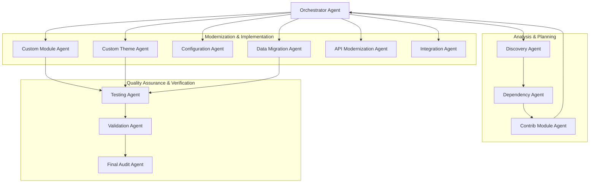

# System Architecture — Drupal Migration Agent Framework

## 1. Architectural Philosophy

The Drupal Migration Agent Framework is engineered around three fundamental tenets:

1. **Reusability Across Projects**: Generic migration intelligence (discovery heuristics, architectural patterns, dependency solvers, modernization mappings) is decoupled from project-specific state, configuration, and code.
2. **Behavioral Replatforming over Syntax Translation**: Drupal 7 procedural constructs (`hook_menu`, `variable_get`, global `$user`, direct `db_query`) cannot be mechanically converted to Drupal 10. The framework extracts business intent and re-engineers it into modern Object-Oriented Programming (OOP) paradigms.
3. **Drupal 10 Target with Drupal 11 Readiness**: While Drupal 10 is the official target, implementations must avoid deprecated D10 APIs that would fail in Drupal 11. Specifically:
   - Prefer **PHP 8 attributes** for plugins where supported (or standard annotations without deprecated sub-keys).
   - Enforce **Dependency Injection (DI)** over static `\Drupal::*` calls.
   - Use `EntityTypeManagerInterface`, `Connection`, and modern event subscribers rather than procedural hooks where events exist.
   - Eliminate deprecated Twig filters and jQuery dependencies in favor of modern JavaScript (ES6+) and Twig components.

---

## 2. Multi-Agent System Topology

The framework utilizes a hub-and-spoke agent model coordinated by an **Orchestrator Agent**. Agents communicate exclusively through structured, deterministic filesystem artifacts.



---

## 3. The 13 Specialized Agents

### 1. Orchestrator Agent (`agents/orchestrator/agent.md`)
- Central director. Reads `migration.config.yml`, maintains `migration-state.yml`, and evaluates the dynamic dependency graph.
- Handles workflow escalation: resolves whether an issue constitutes a **Component Block** or a **Global Migration Block**.

### 2. Discovery Agent (`agents/discovery/agent.md`)
- Non-destructive inspector. Scans Drupal 7 codebase, database schema, file directories, and existing Drupal 10 project structure.
- Populates `state/migration-manifest.yml` with the exhaustive inventory of components to migrate.

### 3. Dependency Agent (`agents/dependency/agent.md`)
- Analyzes module-to-module dependencies, third-party libraries, database foreign keys, and hidden couplings.
- Builds a Directed Acyclic Graph (DAG) and outputs topological sort recommendations to guide Orchestrator dispatching.

### 4. Contrib Module Agent (`agents/contrib-module/agent.md`)
- Analyzes required D7 contrib modules against the Drupal 10 ecosystem.
- Identifies: (a) modules moved to core (Views, CKEditor, Date), (b) official D10 ports, (c) modern replacement modules, or (d) functionality requiring custom implementation. Never selects replacements silently.

### 5. Custom Module Agent (`agents/custom-module/agent.md`)
- First-class migration engine executing a disciplined 12-step modernization lifecycle.
- Refactors custom hooks, schema, forms, entities, routes, and business rules into clean D10/D11 modules.

### 6. Custom Theme Agent (`agents/custom-theme/agent.md`)
- Modernizes presentation layer: converts `.info` to `.info.yml`, PHPTemplate `.tpl.php` to Twig `.html.twig`, registers asset libraries in `libraries.yml`, and ports preprocess logic.

### 7. Configuration Agent (`agents/configuration/agent.md`)
- Migrates D7 variables, field configurations, content types, vocabularies, image styles, text formats, and views into Drupal 10 CMI (Configuration Management Interface) YAML files.

### 8. Data Migration Agent (`agents/data-migration/agent.md`)
- Generates and executes Drupal Migration API pipelines (`migrate_plus`, `migrate_drupal`, `migrate_upgrade`).
- Maps users, roles, taxonomies, nodes, revisions, files, media, comments, and custom SQL tables.

### 9. API Modernization Agent (`agents/api-modernization/agent.md`)
- Re-engineers legacy procedural API usage to modern Symfony/Drupal OOP.
- Enforces Dependency Injection; strictly forbids blind substitution with static `\Drupal::*` calls.

### 10. Integration Agent (`agents/integration/agent.md`)
- Modernizes third-party REST/SOAP consumers, outbound webhooks, external DB connections, SSO providers, and scheduled synchronization jobs into Guzzle-based services.

### 11. Testing Agent (`agents/testing/agent.md`)
- Manages test strategy: generates PHPUnit tests (Unit, Kernel, Functional), verifies code standards (PHPCS), and runs static analysis (PHPStan). Adapts dynamically to project tooling.

### 12. Validation Agent (`agents/validation/agent.md`)
- Rigorous comparative auditor. Compares D7 observed behavior against D10 implemented behavior across 12 dimensions. Assigns evidence-backed verdicts (`PASS`, `PARTIAL`, `FAIL`, `BLOCKED`, `N/A`).

### 13. Final Audit Agent (`agents/final-audit/agent.md`)
- Performs comprehensive post-migration inspection: checks for leftover deprecated APIs, verifies data integrity metrics, validates permissions, and compiles the final sign-off report.

---

## 4. Dual State Management Architecture

To ensure total transparency, reproducibility, and crash resumption, the framework separates state into two complementary files:

```
state/
├── migration-state.yml      # Answers: "WHERE are we in the migration process?"
└── migration-manifest.yml   # Answers: "WHAT exactly are we migrating?"
```

- **`migration-state.yml`**:
  Tracks system-level progress, phase transitions, current active agent, active blockers, completion timestamps, and operational health.
- **`migration-manifest.yml`**:
  Created during Step 1 (Discovery). Serves as the complete registry of every custom module, contrib module, theme, content type, custom table, and data pipeline. Tracks per-component status (`not_started`, `analyzed`, `planned`, `in_progress`, `completed`, `blocked`).

---

## 5. File System & Path Protection Model

The framework enforces strict filesystem boundaries to prevent data loss or project corruption:

```
+-------------------------------------------------------------------+
|                        WORKSPACE ROOT                             |
|                                                                   |
|  [source.path (D7)]       READ-ONLY      (Writes strictly rejected)|
|  ├── modules/                                                     |
|  └── ...                                                          |
|                                                                   |
|  [target.path (D10)]      WRITE-ALLOWED  (Logged modifications)    |
|  ├── web/modules/custom/                                          |
|  └── ...                                                          |
|                                                                   |
|  [migration-agent-framework]  STATE & AUDIT                       |
|  ├── agents/                                                      |
|  ├── reports/                                                     |
|  ├── state/                                                       |
|  └── logs/file-change-log/                                        |
+-------------------------------------------------------------------+
```

- Every write operation is pre-validated against `source.path` and `target.path`.
- Overlapping source and target paths trigger an immediate **Global Migration Block**.
- Every modified, created, or deleted file in `target.path` must generate an entry in `logs/file-change-log/`.
