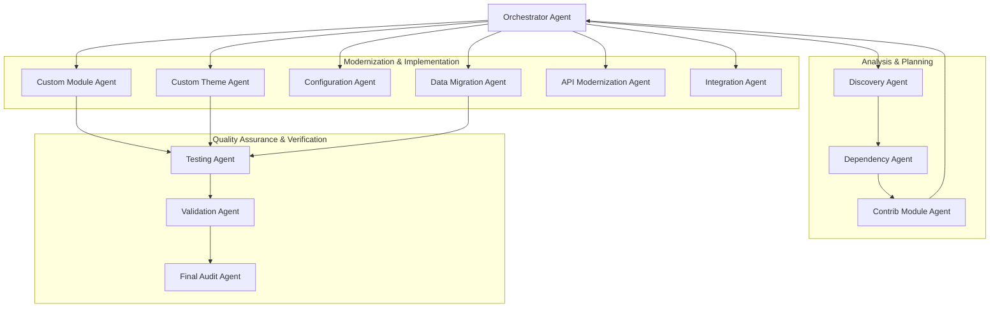

# System Architecture — Drupal Migration Agent Framework

## 1. Architectural Philosophy

The Drupal Migration Agent Framework is engineered around four fundamental tenets:

1. **Decoupled Factory vs. Execution Architecture**: Generic migration intelligence (discovery heuristics, architectural patterns, dependency solvers, modernization mappings, skills) is packaged as a distributable Claude Code plugin, completely separate from customer migration projects and environments.
2. **Behavioral Replatforming over Syntax Translation**: Drupal 7 procedural constructs (`hook_menu`, `variable_get`, global `$user`, direct `db_query`) cannot be mechanically converted to Drupal 10. The framework extracts business intent and re-engineers it into modern Object-Oriented Programming (OOP) paradigms.
3. **Drupal 10 Target with Drupal 11 Readiness**: While Drupal 10 is the official target, implementations avoid deprecated D10 APIs that would fail in Drupal 11:
   - Prefer **PHP 8 attributes** for plugins where supported (or standard annotations without deprecated sub-keys).
   - Enforce **Dependency Injection (DI)** over static `\Drupal::*` calls.
   - Use `EntityTypeManagerInterface`, `Connection`, and modern event subscribers rather than procedural hooks where events exist.
   - Eliminate deprecated Twig filters and jQuery dependencies in favor of modern JavaScript (ES6+) and Twig components.
4. **Agent vs. Skill Separation**: Agents represent autonomous execution roles (workflow, preconditions, postconditions, safety), while Skills represent reusable contextual knowledge playbooks (`SKILL.md`) that agents query on demand.

---

## 2. Factory Architecture vs. Migration Execution Architecture

```text
=============================================================================
1. AGENT FACTORY ARCHITECTURE (This Package)
=============================================================================
- Repository: ironknight24/Drupal-MIgration-Agent
- Standard: Claude Code Plugin (.claude-plugin/plugin.json) + Agent Skills
- Components:
  ├── .claude-plugin/ (plugin.json, marketplace.json)
  ├── commands/ (orchestrate, discover, status)
  ├── agents/ (13 specialized worker specifications)
  ├── skills/ (d7-analysis, d7-to-d10-mapping, d10-architecture, custom-module-migration)
  ├── references/ (D7 APIs, D10 Architecture, Migration Patterns)
  └── templates/ (Deterministic report schemas)
- Lifecycle: Factory Step 0 (Framework) -> Factory Step 1 (Packaging) -> Factory Step 2 (Skills)...

                                    │
                        Installed via Claude Code
                  (/plugin install or --plugin-dir)
                                    │
                                    ▼

=============================================================================
2. MIGRATION EXECUTION ARCHITECTURE (Runtime Project)
=============================================================================
- Workspace: Customer Drupal Migration Project
- Components:
  ├── source.path (Drupal 7 Codebase - strictly READ-ONLY)
  ├── target.path (Drupal 10 Codebase - WRITE-ALLOWED)
  ├── migration.config.yml (Project-specific paths and flags)
  ├── state/ (migration-state.yml, migration-manifest.yml)
  └── reports/ (Generated audit and validation reports)
- Lifecycle: Migration Step 0 (Init) -> Migration Step 1 (Discovery) -> ... -> Validation
```

---

## 3. Multi-Agent System Topology

The framework utilizes a hub-and-spoke agent model coordinated by an **Orchestrator Agent**. Agents communicate exclusively through structured, deterministic filesystem artifacts.



---

## 4. The 13 Specialized Agents & Associated Skills

| # | Agent | Primary Role | Associated Skills & Key References |
|---|---|---|---|
| 1 | **`orchestrator`** | Master workflow coordinator, wave scheduler & global safety gate. | Pure lifecycle governance; `references/migration-patterns/common-conversions.md` |
| 2 | **`discovery`** | Deep read-only inspection of D7 and D10 environments. | `skills/d7-analysis`, `references/drupal-7/apis.md`, `references/drupal-7/hooks.md` |
| 3 | **`dependency`** | Builds dependency DAG and wave planning. | `skills/dependency-analysis`, `references/drupal-7/apis.md` |
| 4 | **`contrib-module`** | Evaluates contrib compatibility, core merges, and ports. | `skills/contrib-evaluation`, `references/drupal-10/architecture.md` |
| 5 | **`custom-module`** | Coordinates 12-step modernization of custom modules. | `skills/custom-module-migration`, `skills/d7-to-d10-mapping`, `skills/d10-architecture` |
| 6 | **`custom-theme`** | Converts PHPTemplate to Twig and modern asset libraries. | `skills/theme-modernization`, `references/drupal-10/twig-filters.md` |
| 7 | **`configuration`** | Translates variables and settings into CMI YAML. | `skills/configuration-migration`, `references/drupal-10/architecture.md` |
| 8 | **`data-migration`** | Architects core Migration API pipelines and table ETL. | `skills/migration-api`, `references/migration-patterns/field-mapping.md` |
| 9 | **`api-modernization`** | Enforces Dependency Injection; forbids blind `\Drupal::*`. | `skills/d7-to-d10-mapping`, `skills/d10-architecture`, `references/drupal-10/` |
| 10 | **`integration`** | Modernizes REST, SOAP, webhooks, and external DB connections. | `skills/integration-modernization`, `skills/d10-architecture` |
| 11 | **`testing`** | Configures and validates PHPUnit, PHPStan, and PHPCS. | `skills/testing`, `references/drupal-10/architecture.md` |
| 12 | **`validation`** | Conducts 12-point comparative behavioral audits. | `skills/behavioral-validation`, `references/migration-patterns/` |
| 13 | **`final-audit`** | Verifies D11 readiness, security posture, and sign-off. | Pure lifecycle governance; All 7 references and validation matrices |

---

## 5. Dual State Management Architecture

The framework strictly separates state into two complementary files:
- **`migration-state.yml`** ("WHERE are we in the migration process?"): Tracks lifecycle progress, active phase, completion timestamps, and active blockers.
- **`migration-manifest.yml`** ("WHAT exactly are we migrating?"): The itemized registry of every discovered custom module, contrib module, theme, content type, and data pipeline.

---

## 6. File System & Path Protection Model

```
+-------------------------------------------------------------------+
|                        WORKSPACE ROOT                             |
|                                                                   |
|  [source.path (D7)]       READ-ONLY      (Writes strictly rejected)|
|  ├── modules/                                                     |
|  └── ...                                                          |
|                                                                   |
|  [target.path (D10)]      WRITE-ALLOWED  (Logged modifications)    |
|  ├── web/modules/custom/                                          |
|  └── ...                                                          |
|                                                                   |
|  [migration-agent-framework]  STATE & AUDIT                       |
|  ├── agents/                                                      |
|  ├── skills/                                                      |
|  ├── commands/                                                    |
|  ├── reports/                                                     |
|  ├── state/                                                       |
|  └── logs/file-change-log/                                        |
+-------------------------------------------------------------------+
```

- Every write operation is pre-validated: writes to `source.path` are rejected immediately.
- Overlapping source and target paths trigger an immediate **Global Migration Block**.
- Every modified, created, or deleted file in `target.path` must generate an entry in `logs/file-change-log/`.
