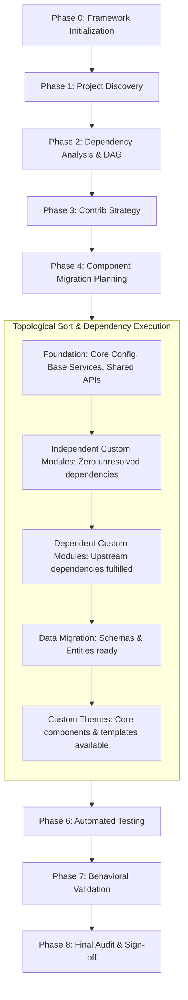

# Migration Lifecycle & Dynamic Execution Model

## 1. Lifecycle Philosophy

The migration from Drupal 7 to Drupal 10 follows a phased, state-driven lifecycle. While a canonical default ordering exists, the framework does **not** assume an immutable linear sequence. 

Real-world Drupal codebases have complex, interconnected dependency structures. Therefore, the **Orchestrator** relies on the **Dependency Agent** to dynamically sequence, parallelize, and isolate components.

---

## 2. Canonical Phases Overview

| Phase | Identifier | Managing Agent | Primary Deliverable |
|---|---|---|---|
| **0** | `framework_init` | Setup (Step 0) | Factory specifications, configuration, templates, state |
| **1** | `discovery` | Discovery Agent | `reports/discovery/`, populated `migration-manifest.yml` |
| **2** | `dependencies` | Dependency Agent | `reports/dependencies/`, dependency DAG, execution sequence |
| **3** | `contrib_strategy`| Contrib Module Agent | `reports/contrib/`, module replacement recommendations |
| **4** | `planning` | Custom Module/Theme | Per-component migration plans in `reports/*/` |
| **5** | `execution` | Specialized Agents | Migrated D10 code in `target.path`, file change logs |
| **6** | `testing` | Testing Agent | `reports/testing/`, PHPUnit/PHPStan/PHPCS outputs |
| **7** | `validation` | Validation Agent | `reports/validation/`, D7 vs D10 behavioral matrices |
| **8** | `final_audit` | Final Audit Agent | `reports/final/final-audit-report.md`, sign-off |

---

## 3. Dynamic Dependency-Aware Execution Engine

### Dynamic Sequencing Rules

1. **Topological Ordering**: Custom modules are analyzed as a directed graph. Independent leaf modules (modules with no custom dependencies) migrate first. Dependent modules follow only after their dependencies are validated.
2. **Dependency Overrides**:
   - If a custom module defines an entity type required by a data migration, that module's code migration is promoted *ahead* of the data migration phase.
   - If a configuration import requires a contrib replacement module, the contrib module must be downloaded and enabled in D10 *before* the configuration agent imports that config.
3. **Parallelism Boundaries**:
   - **Allowed in Parallel**: Distinct custom modules that share no mutual dependencies; static theme asset conversion; documentation generation.
   - **Strictly Sequential**:
     - Schema definition (`hook_schema` -> Entity/Table) *before* data migration.
     - Module implementation *before* module unit/kernel testing.
     - Testing execution *before* behavioral validation.
     - Final audit *only after* all components reach terminal status (`completed` or `blocked`).
4. **Upstream Block Propagation**:
   - When Module A fails and is marked `status: blocked`, any Module B depending on Module A is automatically marked `status: blocked_upstream`.
   - Independent Module C continues execution without interruption.

---

## 4. Resumption & Re-entrancy Protocol

The framework is strictly **resumable**. If execution stops due to human intervention, a system reboot, or a blocked task, agents do not start over from scratch.

### Resumption Algorithm

When the Orchestrator initiates:
1. Inspect `state/migration-state.yml`:
   - Check `global_block`. If `true`, abort immediately and point to `reports/blocked/BLOCKED-000-GLOBAL.md`.
   - Determine `current_phase`.
2. Inspect `state/migration-manifest.yml`:
   - Identify all components with status `in_progress`. Revert their transient state, check file change logs, and restart the specific component plan.
   - Identify components with status `not_started`.
   - Skip all components with status `completed`.
   - Skip components with status `blocked` unless explicitly instructed to retry.
3. Resume execution at the earliest incomplete phase based on the dependency DAG.

---

## 5. Phase Transition Criteria

An agent may only advance the phase in `state/migration-state.yml` when all of the following criteria are satisfied:
- All target deliverables for the phase exist in `reports/` and match their respective schemas.
- No components remain in `in_progress` status.
- Any blocked items have corresponding `reports/blocked/BLOCKED-XXX.md` tickets.
- Phase postconditions defined in `AGENT_PROTOCOL.md` evaluate to `TRUE`.
