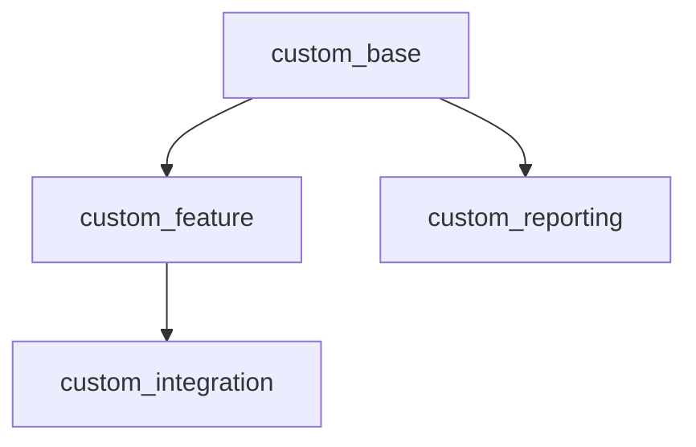

# Project Dependency Analysis & Dynamic Execution Graph

## 1. Executive Summary
- **Total Components Analyzed**: {{ TOTAL_COMPONENTS }}
- **Independent Modules (Wave 1)**: {{ WAVE_1_COUNT }}
- **Dependent Modules (Waves 2+)**: {{ WAVE_2_COUNT }}
- **Circular Dependencies Identified**: {{ CYCLIC_COUNT }}

---

## 2. Component Dependency Mapping

| Component Name | Type | Declared Dependencies (.info) | Implicit / Schema Couplings | Required Contribs |
|---|---|---|---|---|
| `custom_base` | Custom Module | None | None | None |
| `custom_feature` | Custom Module | `custom_base` | Direct DB join on `custom_base_tbl` | `ctools` |

---

## 3. Directed Acyclic Graph (Mermaid)

---

## 4. Recommended Execution Waves

### Wave 0: Foundation
- Base configuration entities
- Shared utilities with zero custom dependencies

### Wave 1: Leaf Custom Modules (Parallelizable)
- Modules with no unmet internal dependencies

### Wave 2: Intermediate Custom Modules (Sequential)
- Modules dependent on Wave 1

### Wave 3: Data Migration Pipelines
- Entity and table migrations dependent on Wave 1 & 2 schema

### Wave 4: Presentation & Themes
- Custom themes dependent on final markup render arrays

---

## 5. Blocking Dependencies & Critical Path
- **Critical Path**:
- **Identified Risks**:
